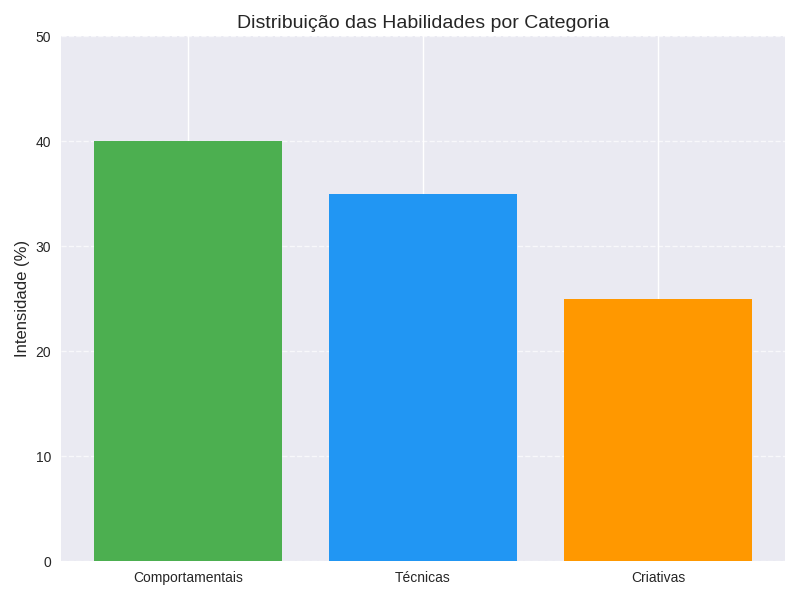
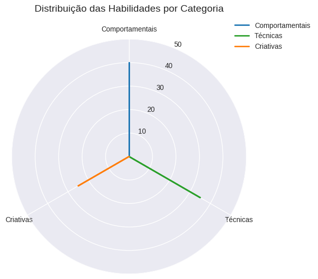

# 📘 Mapa de Habilidades

## 🎯 Objetivo
Este repositório organiza minhas principais habilidades técnicas, comportamentais e criativas, mostrando como podem ser aplicadas em projetos reais e transformadas em oportunidades de trabalho.

---
## 📌 Sobre
Este projeto foi desenvolvido como parte do **Bootcamp Caixa – Inteligência Artificial na Prática**,promovido pela **DIO (Digital Innovation One)**. Ele reúne minhas principais habilidades técnicas, comportamentais e criativas em um portfólio visual e objetivo.

---

## 📂 Estrutura do Repositório
- [docs/pitch_deck.md](docs/pitch_deck.md) → Estrutura completa do Pitch Deck (slide a slide)  
- [docs/resumo_executivo.md](docs/resumo_executivo.md) → Resumo final com frase de impacto  
- [docs/quadro_oportunidades.md](docs/quadro_oportunidades.md) → Tabela com atividades e formas de monetização  
- [docs/Projeto_Mapa_de_Habilidades.md](docs/Projeto_Mapa_de_Habilidades.md) → Documento consolidado com todas as etapas  
- [visuals/grafico_pizza.png](visuals/grafico_pizza.png) → Gráfico de Pizza das habilidades  
- [visuals/grafico_barras.png](visuals/grafico_barras.png) → Gráfico de Barras comparativo  
- [visuals/grafico_radar.png](visuals/grafico_radar.png) → Gráfico de Radar (perfil dinâmico)  
- [presentations/pitch_deck.pptx](presentations/pitch_deck.pptx) → Apresentação em slides  

---

## 📊 Visualizações

### Gráfico de pizza  
  

### Gráfico de barras  
  

### Gráfico de radar  
  

---

## 💼 Serviços e Oportunidades
- Criação de soluções com IA  
- Suporte digital remoto  
- Serviços administrativos e burocráticos  
- Gestão financeira pessoal/familiar  
- Criação de páginas web/sites  
- Produção de apresentações visuais  
- Consultoria em uso de IA  
- Treinamentos digitais  
- Artesanato e costura sob encomenda  
- Mentoria em habilidades comportamentais 

---

## 📈 Caminhos de Monetização
- Oferecer serviços em plataformas de freelas (Workana, 99Freelas, Fiverr, GetNinjas)  
- Criar conteúdo gratuito em redes sociais (Instagram, TikTok, LinkedIn, YouTube)  
- Montar portfólio simples no GitHub com docs e visuals  
- Fazer parcerias locais com pequenos negócios  
- Dar aulas ou mentorias online/presenciais  

---
## 📝 Mini cases (exemplos práticos)
- **Organização digital:** Estruturei arquivos e rotinas, reduzindo erros operacionais estimados em 30%.  
- **Slides com IA:** Criei apresentações mais envolventes, melhorando a clareza e o engajamento em avaliações.  
- **Automação leve:** Apliquei ferramentas de IA para tarefas repetitivas, liberando cerca de 2 horas semanais.

---

## 🛠️ Como usar este repositório
1. Explorar habilidades no README.md  
2. Visualizar documentos em `docs/`  
3. Ver gráficos em `visuals/`  
4. Consultar apresentações em `presentations/`  

---

## 📜 Licença
Este projeto está licenciado sob a [MIT License](LICENSE).

---

## 👩‍💻 Contato
- LinkedIn: [linkedin.com/in/seuusuario](https://www.linkedin.com/in/joelma-campos-50a7277b)  
- GitHub: [github.com/jfcampos5](https://github.com/jfcampos5)  
- E-mail: jfcampos5@hotmail.com  

---

## 🌍 English Summary (optional)
This repository organizes my skills into a clear portfolio with documents, visuals, and a pitch deck. It highlights opportunities for monetization and professional growth, making it easy for recruiters and collaborators to understand my profile.

---
# ✅ Checklist de Finalização do Projeto

- [x] Substituir o README atual pelo modelo finalizado (com links, imagens, contatos e badges).
- [x] Adicionar o arquivo LICENSE com o texto da MIT License.
- [x] Confirmar que os documentos em `docs/` estão criados (revisar conteúdo e padronização).
- [x] Garantir que os gráficos estão na pasta `visuals/`.
- [x] Embutir gráficos no README.
- [x] Finalizar seção de Visualizações no README.
- [x] Adicionar seção de **Contato** com LinkedIn, GitHub e e-mail.
- [x] Renderizar corretamente os **badges** no topo do README.
- [ ] Inserir 1–2 **mini cases** ou exemplos práticos de aplicação das habilidades (com resultados reais ou simulados).
- [ ] Revisar consistência de escrita (acentos, títulos, padronização nos documentos internos).
- [ ] (Opcional) Publicar uma release “v1.0 – Perfil e Apresentação”.

